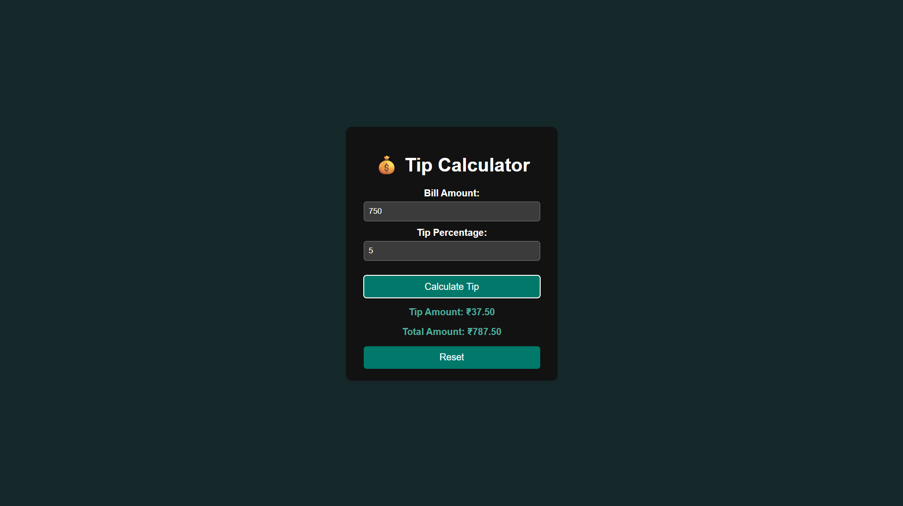

# Tip Calculator 💰

A mini-project built as part of the  
**[UI Developer Training Program](https://github.com/MylapalliYesebu/UI-Developer-Training-Projects.git) (Phase 2)**  
– a CSR initiative of Infosys Foundation at Ideal Institute of Technology.

---

## 📋 Project Overview

The Tip Calculator helps users quickly calculate how much tip to leave based on the bill amount and tip percentage entered.  
It also shows the total amount (bill + tip) in real-time with a clean, user-friendly interface.

---

## ✨ Features

- Enter bill amount and tip percentage  
- Calculates tip and total amount instantly  
- Input validation with clear error messages  
- Reset button to clear inputs and results  
- Smooth animation for displaying results  
- Responsive and professional UI design  

---

## ⚙️ Tech Stack Used

- **HTML** – Structure of the calculator  
- **CSS** – Styling and layout  
- **JavaScript** – Logic, DOM manipulation, and event handling  

---

## 🧠 Learning Objectives

This project helped me practice:

- JavaScript arithmetic operations  
- DOM selection and manipulation  
- Event handling with buttons  
- UI interaction and user feedback  
- Structuring and styling a mini web app  

---

## 📸 Screenshot

  

---

## 🧪 Live Demo

👉 [View the live demo](https://MylapalliYesebu.github.io/Tip-Calculator/)  

---

## 🔗 Related Projects

This project is part of my full UI Developer Training Project series:  
👉 [UI Developer Training Projects](https://github.com/MylapalliYesebu/UI-Developer-Training-Projects)  

---

## 👤 Author

- **Mylapalli Yesebu**  
- [GitHub](https://github.com/MylapalliYesebu)  
- 📧 [yesebymylapalli08@gmail.com](mailto:yesebymylapalli08@gmail.com)
