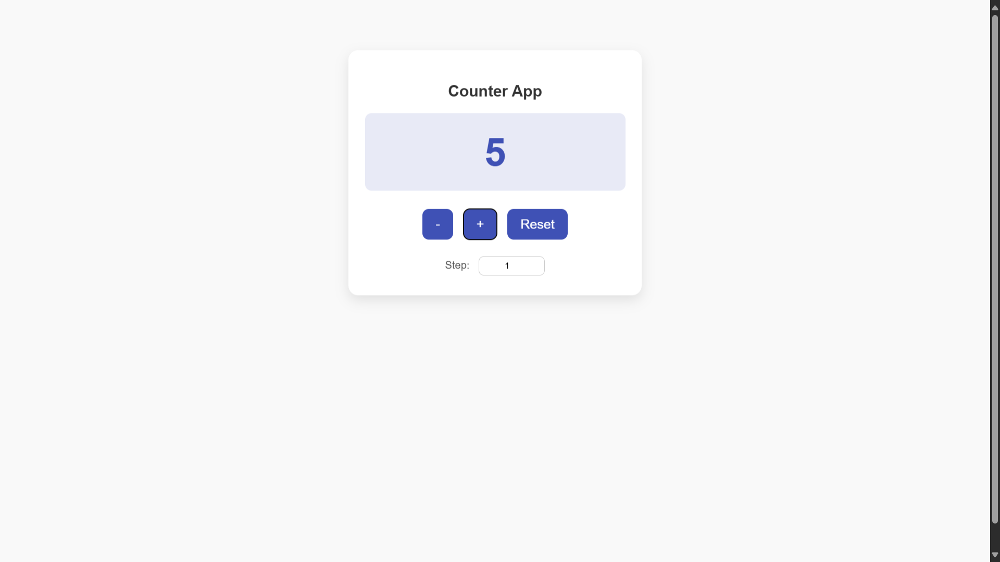

# ⚛️ Counter App

This is a **mini-project** built as part of the  
**[UI Developer Training Program](https://github.com/MylapalliYesebu/UI-Developer-Training-Projects.git)** (Phase 2),  
a CSR initiative of **Infosys Foundation** at **Ideal Institute of Technology**.

---

## 📋 Description

The **Counter App** is a simple yet effective **Angular** application designed to demonstrate core **Angular concepts** such as **components**, **data binding**, and **event handling**.

This app allows users to **increment**, **decrement**, and **reset** a counter value dynamically. It serves as a beginner-friendly project for understanding how **Angular standalone components** work and how UI updates reactively respond to state changes.

---

## 🛠️ Tech Stack

* **Angular (v20+)** – Component-based front-end framework
* **TypeScript** – Application logic
* **CSS** – Styling and layout
* **HTML** – UI structure

---

## 🎯 Features

* ✅ Increment the counter value
* ✅ Decrement the counter value
* ✅ Reset the counter to zero
* ✅ Change step value dynamically
* ✅ Real-time UI updates using Angular signals
* ✅ Clean, responsive design

---

## 🧠 Learning Objectives

This project helped me understand:

* Setting up an Angular project using `ng new`
* Creating **standalone components**
* Using **data binding** and **event handling**
* Updating UI reactively with component logic
* Structuring and styling Angular components

---

## 📸 Screenshot

---

## 🧪 Live Demo

👉 [View the live demo](https://mylapalliyesebu.github.io/counter-app-angular/)

---

## 🔗 Related Projects

This project is part of my full **UI Developer Training Project Series**:  
👉 [UI Developer Training Projects](https://github.com/MylapalliYesebu/UI-Developer-Training-Projects)

---

## 👤 Author

* **Mylapalli Yesebu**
* [GitHub](https://github.com/MylapalliYesebu)
* [Gmail](mailto:yesebumylapalli08@gmail.com)
