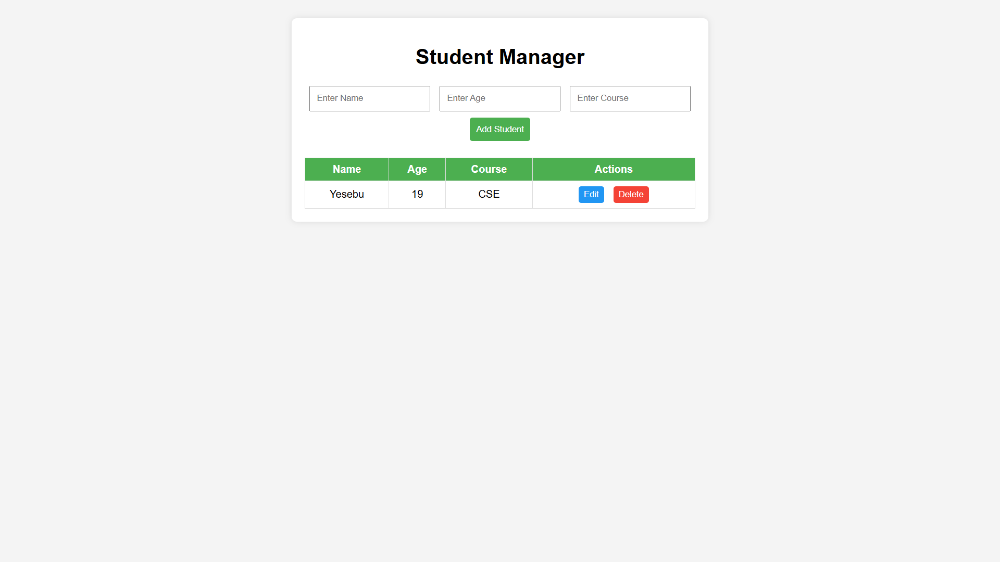

# 🧑‍🎓 Student Manager

This is a **mini-project** built as part of the
**[UI Developer Training Program](https://github.com/MylapalliYesebu/UI-Developer-Training-Projects.git)** (Phase 2),
a CSR initiative of **Infosys Foundation** at **Ideal Institute of Technology**.

---

## 📋 Description

The **Student Manager** is a dynamic web application designed to manage student details easily.
Users can add students with their **Name**, **Age**, and **Course**, which are displayed in a clean **table layout**.
Each record comes with **Edit** and **Delete** buttons for better data management.

This version focuses on practical CRUD-like (Create, Read, Update, Delete) operations using only **HTML**, **CSS**, and **JavaScript**, helping to strengthen DOM manipulation and UI logic skills.

---

## 🛠️ Tech Stack

* **HTML** – Structure of the application
* **CSS** – Styling and table layout
* **JavaScript** – Logic for adding, editing, and deleting students

---

## 🎯 Features

✅ Add new students (Name, Age, Course)
✅ Display students in a formatted table layout
✅ Edit student details directly from the table
✅ Delete any student record
✅ Clean, minimal, and responsive interface

---

## 🧠 Learning Objectives

This project helped me practice and understand:

* DOM manipulation with JavaScript
* Dynamic table creation and updates
* Handling user inputs and events
* Editing and deleting data in real-time
* Clean and responsive UI design

---

## 📸 Screenshot

---

## 🧪 Live Demo

👉 [View the live demo](https://mylapalliyesebu.github.io/student-manager/)  

---

## 🔗 Related Projects

This project is part of my full **UI Developer Training Project Series**:
👉 [UI Developer Training Projects](https://github.com/MylapalliYesebu/UI-Developer-Training-Projects)

---

## 👤 Author

* **Mylapalli Yesebu**
* [GitHub](https://github.com/MylapalliYesebu)
* [Gmail](mailto:yesebumylapalli08@gmail.com)
