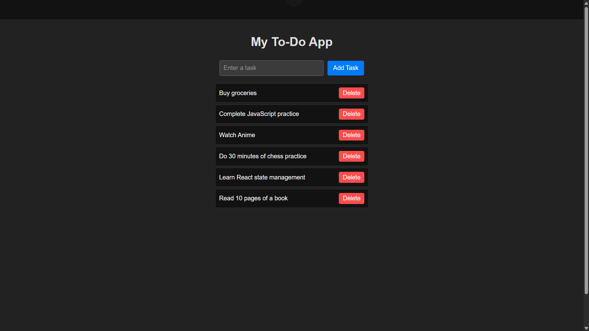

# ⚛️ To-Do App

This is a **mini-project** built as part of the  
**[UI Developer Training Program](https://github.com/MylapalliYesebu/UI-Developer-Training-Projects.git)** (Phase 2),  
a CSR initiative of **Infosys Foundation** at **Ideal Institute of Technology**.

---

## 📋 Description

The **To-Do App** is a simple **ReactJS** application designed to demonstrate core **React concepts** such as **state management**, **dynamic rendering**, and **event handling**.

This app allows users to **add**, **delete**, and **mark tasks as completed**. Tasks are stored in **localStorage**, allowing them to **persist across page reloads**. This project is beginner-friendly and teaches how **React Hooks (useState, useEffect)** manage dynamic data and UI updates efficiently.

---

## 🛠️ Tech Stack

* **ReactJS** – Component-based front-end framework
* **JavaScript (ES6)** – Application logic
* **CSS** – Styling and layout
* **HTML (JSX)** – UI structure

---

## 🎯 Features

* ✅ Add tasks using input box or Enter key
* ✅ Delete tasks dynamically
* ✅ Mark tasks as completed (strike-through)
* ✅ Tasks persist using localStorage
* ✅ Clean, responsive UI design

---

## 🧠 Learning Objectives

This project helped me understand:

* Setting up a React app using `create-react-app`
* Using **useState** and **useEffect Hooks** for dynamic state and persistence
* Handling user events and updating UI reactively
* Structuring and styling React components
* Working with arrays and objects in React state

---

## 📸 Screenshot

---

## 🧪 Live Demo

👉 [View the live demo](https://mylapalliyesebu.github.io/todo-app-react/)

---

## 🔗 Related Projects

This project is part of my full **UI Developer Training Project Series**:  
👉 [UI Developer Training Projects](https://github.com/MylapalliYesebu/UI-Developer-Training-Projects)

---

## 👤 Author

* **Mylapalli Yesebu**
* [GitHub](https://github.com/MylapalliYesebu)
* [Gmail](mailto:yesebumylapalli08@gmail.com)
