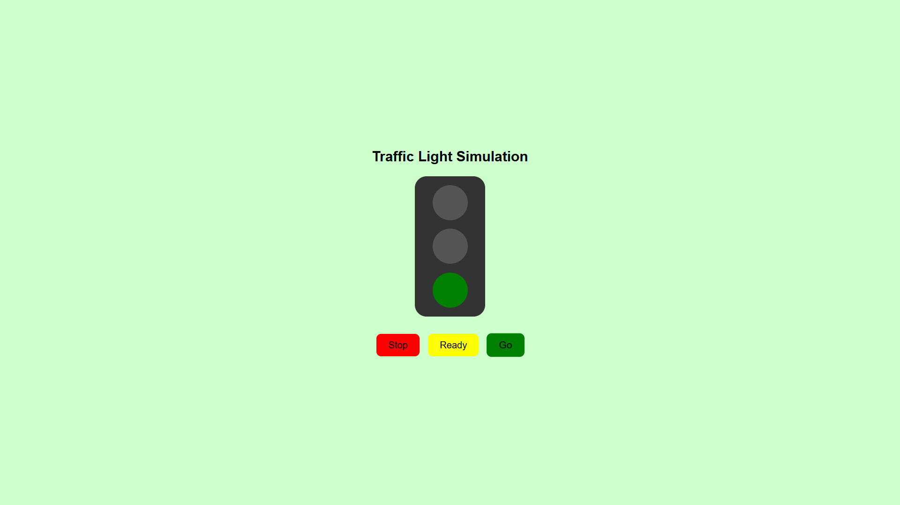

# Traffic Light Simulation 🚦

This is a **mini-project** built as part of the  
**[UI Developer Training Program](https://github.com/MylapalliYesebu/UI-Developer-Training-Projects.git)** (Phase 2),  
a CSR initiative of **Infosys Foundation** at **Ideal Institute of Technology**.

---

## 📋 Description

The **Traffic Light Simulation** project is an interactive web application that mimics real-world traffic lights. Users can control the traffic signals using three buttons: **Stop**, **Ready**, and **Go**, which turn on the **Red**, **Yellow**, and **Green** lights, respectively. The page background color also changes to match the active signal, providing clear visual feedback.

This project is built using **HTML**, **CSS**, and **JavaScript**, demonstrating **DOM manipulation**, **event handling**, and **dynamic styling**.

---

## 🛠️ Tech Stack

* **HTML** – Structure of traffic lights and control buttons
* **CSS** – Styling, Flexbox layout, and smooth transitions
* **JavaScript** – Logic for activating lights and updating background colors

---

## 🎯 Features

* ✅ Three control buttons: Stop (Red), Ready (Yellow), Go (Green)
* ✅ Lights turn on/off dynamically based on button clicks
* ✅ Background color changes according to the active light
* ✅ Smooth transitions for lights and buttons
* ✅ Simple, clean, and responsive interface

---

## 🧠 Learning Objectives

This project helped me practice and understand:

* Selecting and manipulating DOM elements with JavaScript
* Handling user interactions with event listeners
* Updating element styles dynamically
* Flexbox layout and responsive design
* Creating a visual interactive web experience

---

## 📸 Screenshot

---

## 💮 Live Demo

👉 [View the live demo](https://mylapalliyesebu.github.io/traffic-light/)

---

## 🔗 Related Projects

This project is part of my **UI Developer Training Project Series**:

👉 [UI Developer Training Projects](https://github.com/MylapalliYesebu/UI-Developer-Training-Projects)

---

## 👤 Author

* **Mylapalli Yesebu**
* [GitHub](https://github.com/MylapalliYesebu)
* [Gmail](mailto:yesebumylapalli08@gmail.com)
